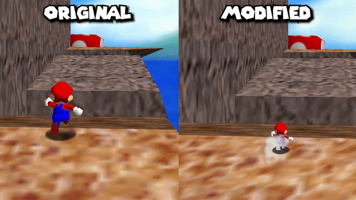

# Super Mario 64 but he is very small and fragile #
- [How To Setup](#how-to-setup)
  - [Download Patch File](#download-patch-file)
  - [Instruction](#instruction)
- [Inspirations for the Mod / Challenge](#inspirations-for-the-mod--challenge)
  - [Video Inspirations](#video-inspirations)
  - [Why I created the Mod](#why-i-created-the-mod)
  - [Why I documentate everything](#why-i-documentate-everything)
- [Creation Process of the Mod](#creation-process-of-the-mod)
  - [Preperations](#preperations)
  - [Editing of the Code](#editing-of-the-code)
- [My Main Videos of the Challenge](#My-Main-Videos-of-the-Challenge)

<br>

# How To Setup # 
This is how you set up this Mod.

## Download Patch File ##
Download the Patch File of the Mod: <br>
... Link coming soon ...

## Instruction ##
Check out this Repository to see how you can setup most Super Mario 64 Mods: <br>
https://github.com/StarlyTTV/How-to-Setup-a-Super-Mario-64-Mod

<br>

# Inspirations for the Mod / Challenge #
This is how I was inspired to create his Mod and try out this Challenge.

## Video Inspirations ##
I saw this Mod in Super Mario Odyssey in a Video of SmallAnt:

<a href="https://www.youtube.com/watch?v=3t7oWX5d9nI"></a>
<br> Mod Creator: https://www.youtube.com/@CraftyBoss925

## Why I created the Mod ##

I'm trying to learn how to create Mods for Games that interest me (like the 3D Mario Games), so I thought that I would try to recreate another Mod Idea in Super Mario 64 (because it didn't exist in that game yet) for the beginning. I'm planning of creating more and more unique Mods as time goes on and learn more and more things.

## Why I documentate everything ##
1. I myself wanna remember in the future, what I exactly did, since I wanna create more Mods
   
2. I wanna inspire people to try out and create Mods themselves and I think if I show off how I did it, it could give people an idea of how they could do the same

<br>

# Creation Process of the Mod #
I will explain how I created the Mod.

## Preperations ##
To edit the Source Code of Super Mario 64, I got the UltraSM64 repository set up. 

The UltraSM64 Repository is a Fork of the SM64 decompilation project that adds several quality-of-life patches: <br>
https://github.com/CrashOveride95/ultrasm64

A fork is a new repository that shares code with the original repository, where you can make changes without affecting the original repository.

--> The Super Mario 64 Decompilation Project is an absolutely impressive project by Fans that reverse engineered and decompiled the entire source Code of Super Mario 64. Saying it more simplified, they analyzed the machine code and recreated the code in a higher-level programming language.

### How to setup the repository ###
To setup the repository I followed this tutorial, but instead of cloning the HackerSM64 repository, I cloned the UltraSM64 repository: <br>
https://github.com/HackerN64/HackerSM64/wiki/Installing-HackerSM64

## Editing of the Code ##
After setting up the repository, I tried to edit the Mario 64 Code for the first time.

For editing the Code I would recommend everyone to use Visual Studio Code: <br>
https://code.visualstudio.com/

For a lot of questions I had, the "SM64 Rom Hacks" Discord Server helped me out a lot (Thank you so much ❤️): <br>
https://discord.com/invite/BYrpMBG

I wanna say, that this is my first Mod for the Game I ever made, so I just changed stuff to my liking until it felt right. I used a lot of Code parts over and over again and I am aware that my changes could be optimized so much further and aren't the most optimal way to create this Mod.

### File Listing ###
These are all the Files, that I changed:

General Files:

* src\game\object_list_processor.c
* src\game\mario.c
* src\game\mario_actions_moving.c
* src\game\mario_actions_airbone.c
* src\game\mario_actions_submerged.c
* src\game\behaviours\level_update.c
* text\us\dialogs.h
* text\us\courses.h

Level Files:

* levels\ddd\script.c
* levels\castle_inside\script.c
* levels\bits\script.c

### What I changed ###
Here are the changes listed, that I made to the files.

____________________________________
#### src\game\object_list_processor.c --> Is used to process objects within the game.

To change Marios size permanently (shrinking him down by 50%) I added the following Code to the Function **"bhv_mario_update"**: <br>
```C
// Apply scaling here
f32 scale = 0.5; // Set the desired scaling factor (e.g., 50%)
    
// Apply scaling to the Mario object's scale vector
gCurrentObject->header.gfx.scale[0] = scale;
gCurrentObject->header.gfx.scale[1] = scale;
gCurrentObject->header.gfx.scale[2] = scale;
```


____________________________________
#### src\game\mario.c --> Contains the logic of functionalities regarding Mario.

Mario should die each time he gets damage, so I changed "m->health" to "0", no matter the damage reason in the function **"update_mario_health"**:

Normal Damage:
```C
if (!(m->flags & MARIO_METAL_CAP) && !gDebugLevelSelect) {
                    // Set Mario's health to zero when he takes damage
                    m->health = 0;
                }
```

 <br>

Underwater Damage:
```C
if ((m->action & ACT_FLAG_SWIMMING) && !(m->action & ACT_FLAG_INTANGIBLE)) {
    terrainIsSnow = (m->area->terrainType & TERRAIN_MASK) == TERRAIN_SNOW;

    // Check if Mario is in the Metal Mario state
    s32 hasMetalCap = (m->flags & MARIO_METAL_CAP) != 0;

    ... Other Code here ...

    } else if (!gDebugLevelSelect) {
        // Check if Mario is not in the Metal Mario state
        if (!hasMetalCap) {
            // Set Mario's health to zero when he takes damage underwater (not in the Metal Mario State)
            m->health = 0;
        }
    }
}
```

 <br>


--> if (!hasmetal) is needed, so that this rule only applies when Mario is NOT in the "Metal Mario State"

I changed Mario's Lives he gets in the beginning to 100, so you wouldn't constantly get a Game Over in the function **"init_mario_from_save_file"**:
```C
gMarioState->numLives = 100;
```

Lives in Game: <br>


____________________________________
#### src\game\mario_actions_moving.c --> Handles behaviour of Mario while Moving

I changed a bunch of speed stats. I just searched for speed, looked what the respective speed stat is for (walking speed, shell speed, etc ...) and changed it, until it felt right.

Example for walking speed:
```C
if (m->floor != NULL && m->floor->type == SURFACE_SLOW) {
        maxTargetSpeed = 15.0f;
    } else {
        maxTargetSpeed = 17.0f;
    }
```
--> The first stat is for the walking speed on slow surfaces and the second one for normal surfaces

Speed Comparison: <br>

 <br>


So that you directly die, once you get fire damage on the ground, I changed this line in the function **"act_burning_ground"**:
```C
// Decrease health to 0 instantly
    m->health = 0;
```
 <br>
____________________________________
#### src\game\mario_actions_airborne.c --> Handles behaviour of Mario while in the air.

First I had to edit some threshold values.

Example for Long Jump:
```C
dragThreshold = m->action == ACT_LONG_JUMP ? 12.0f : 8.0f;
```

Then I changed a bunch of jump heights and set speed limits (Normal Jump, Backflip, Long Jump, lava bounce, box bounce, flying, etc ...).

To limit the jump height, you can use the following command in the respective function of the jump type (maxJumpHeight needs to be edited to the respective height):
```C
f32 maxJumpHeight = 30.0f;  // Adjust this value to set the maximum jump height

    // Limit the jump height
    if (m->vel[1] > maxJumpHeight) {
        m->vel[1] = maxJumpHeight;
    }
```

To limit the speed you can use the following command in the respective function of the jump type (maxHorizontalSpeed needs to be edited to the respective speed limit):

```C
f32 maxHorizontalSpeed = 30.0f;  // Adjust this value to set the maximum horizontal speed

// Limit the horizontal speed
    if (m->forwardVel > maxHorizontalSpeed) {
        m->forwardVel = maxHorizontalSpeed;
    }
```
 <br>


To make things like the BLJ (Backwards Longjump) Glitch and other exploits (where you go backwards and get more speed than you should) impossible, I had to limit the backwards velocity of a bunch of Jump types.

Example for Long jump:
```C
s32 act_long_jump(struct MarioState *m) {

    // Limit the backward velocity if it's too high
    if (m->forwardVel < -8.0f) {
        m->forwardVel = -8.0f;
    }
```
 <br>


I changed Marios fallheight and damageheight, so he can't jump from too high before getting damage (He can jump as high as a small double jump). I changed the numbers before the "f"s until I got my expected result:
```C
if (m->actionState == ACT_GROUND_POUND) {
        damageHeight = 40.0f;
    } else {
        damageHeight = 35.0f;
    }

#pragma GCC diagnostic pop

    if (m->action != ACT_TWIRLING && m->floor->type != SURFACE_BURNING) {
        if (m->vel[1] < -35.0f) {
            if (fallHeight > 50.0f) {
```
Basically you can't jump or fall heigher than a small double jump. As soon as you do more than that, you die:
 <br>


So that Mario will always get stuck when he jumps above snow/sand, I changed the peakHeight to a  negative number in the function **"should_get_stuck_in_ground"**:
```C
if (!(flags & 0x01) && m->peakHeight - m->pos[1] > -1.0f && floor->normal.y >= 0.8660254f)
```
 <br>


The general Fallheight doesn't include the move "forward rollout", so I had to add the fallheight for that move in the function **"act_forward_rollout"**:
```C
// Check for fall damage when exceeding 170 units of fall height
            if (m->vel[1] < 0.0f) {
                f32 fallHeight = m->peakHeight - m->pos[1];
                if (fallHeight > 170.0f) {
                    // Use the check_fall_damage_or_get_stuck function
                    if (!check_fall_damage_or_get_stuck(m, ACT_HARD_FORWARD_GROUND_KB)) {
                        // Play fall damage animation (e.g., a spinning animation)
                        set_mario_animation(m, MARIO_ANIM_FORWARD_FLIP);
                    }
                }
            }
            break;
```

Move Forward Rollout: <br>
<a href="https://youtu.be/tyu1KO3x5Ps?t=624"></a>

So that you directly die, once you get fire damage on the ground, I added this line in the functions **"act_burning_jump"** and **"act_burning_fall"**:
```C
// Decrease health to 0 instantly
    m->health = 0;
```
 <br>

--> This is basically just optimization, so that you die already in the air and not only once you hit the ground
____________________________________
#### src\game\mario_actions_submerged.c --> Handles behaviour of Mario while submerged underwater / on top of the water.

I changed the swimming speed to be really slow:
```C
f32 maxSpeed = 7.0f;
```
 <br>

____________________________________
#### src\game\level_update.c --> Handles level change behaviours, that happen when certain conditions are met 

I changed the star total, needed to fight the final boss from 70 to 60, so I had to change this line in the function **"check_instant_warp"**
```C
if (gCurrLevelNum == LEVEL_CASTLE
        && save_file_get_total_star_count(gCurrSaveFileNum - 1, COURSE_MIN - 1, COURSE_MAX - 1) >= 60) {
        return;
    }
```

____________________________________
#### text\us\dialogs.h --> Contains written dialog of the game

I changed the written dialog in the beginning cutscene of the game (Dialog 20):
```h
DEFINE_DIALOG(DIALOG_020, 1, 6, 95, 150, _("\
Dear Mario:\n\
You are short. Lol."))
```


I changed the text before the infinite staircase, so you get the information that you need 60 stars instead of 70 (Dialog 29):
```h
DEFINE_DIALOG(DIALOG_029, 1, 5, 95, 200, _("\
To open the door that\n\
leads to the 『endless』\n\
stairs, you need 60\n\
Stars.\n\
Bwa ha ha!"))
```


The text when you get 70 star was left in the game, but heavily altered, so you get congratulated for this achievement (Secret Message if someone actually manages to get 70 stars).:
```h
DEFINE_DIALOG(DIALOG_146, 1, 6, 150, 200, _("\
You've found 70 Power\n\
Stars! Something I couldn't\n\
do. You are absolutely amazing!!!\n\
I had to lower the star count\n\
required to beat the final Bowser\n\
to 60, to make it possible for me.\n\
You are truly a pro Mario Player\n\
and an absolute Legend!!!"))
```

____________________________________
#### text\us\courses.h --> Contains the course and star names of the game

I changed the course name of "Dire Dire Docks" and the first two star names:
```h
COURSE_ACTS(COURSE_DDD, _(" 9 DON'T WORRY ABOUT IT"),
       _("I'M PROUD OF YOU FOR MAKING IT THIS FAR !!!")            , _("YOU WILL NOT GET THIS ONE HAHA") ... Other Code here ...
```
 <br>

____________________________________
#### Quad64 Program
Before I go into more detail of specific level changes I made, I need to talk about Quad64.

Quad64 is an Open Source SM64 Level Editor:
https://github.com/DavidSM64/Quad64

I used it to find out specific coordinates of certain level objects and which objects are in which areas of a certain level: <br>


#### levels\ddd\script.c --> Contains objects and warps, loads in models, etc... for the level "Dire Dire Docks"

I <span style="color:yellow"> removed </span> the star of the second area / Removed this line of the function **"script_func_local_5[]"**):
```c
OBJECT_WITH_ACTS(/*model*/ MODEL_STAR, /*pos*/ 3900,   850,  -600, /*angle*/ 0, 0, 0, /*behParam*/ 0x00000000, /*beh*/ bhvStar,                    /*acts*/ ALL_ACTS),
```

and <span style="color:yellow"> added </span> the star to the function **"script_func_local_1[]"** (First Area):
```c
static const LevelScript script_func_local_1[] = {
    OBJECT_WITH_ACTS(/*model*/ MODEL_STAR, /*pos*/ -3071,   0,  0, /*angle*/ 0, 0, 0, /*behParam*/ 0x00000000, /*beh*/ bhvStar, /*acts*/ ACT_1),
```

--> I also changed the coordinates of the location, where Mario spawns, so he can grab the star before he drowns

--> In addition I also made the star only obtainable if you select the first mission

Star in Game: <br>
<a href="https://youtu.be/tyu1KO3x5Ps?t=624"></a>

____________________________________
#### levels\castle_inside\script.c --> Contains objects and warps, loads in models, etc... for the castle inside

I changed the location of the star exit warp of the Level "Tick Tock Clock" farther back, so that you spawn right before the clock instead of on the ground.
```c
OBJECT(/*model*/ MODEL_NONE, /*pos*/  -205, 2918,  7470, /*angle*/ 0,   0, 0, /*behParam*/ 0x00350000, /*beh*/ bhvPaintingStarCollectWarp),
```
 <br>

I changed the location of the death exit warp of the Level "Tick Tock Clock" farther back, so that you spawn right before the clock instead of on the ground.
```c
OBJECT(/*model*/ MODEL_NONE, /*pos*/  -205, 2918,  7470, /*angle*/ 0,   0, 0, /*behParam*/ 0x00670000, /*beh*/ bhvPaintingDeathWarp),
```

 <br>

--> I used Quad64 to find out which Warps I had to change. For this I looked at the coordinates of the warp zone and changed the one which had the same coordinates.

____________________________________
#### levels\bits\script.c --> Contains objects and warps, loads in models, etc... for the level "Bowser in the sky"

I had to change the location of the Object "Ferris Wheel Axle" higher up, so that the level is possible:
```c
OBJECT(/*model*/ MODEL_BITS_FERRIS_WHEEL_AXLE,      /*pos*/ -1748, -1230, -1094, /*angle*/ 0, 0, 0,   /*behParam*/ 0x00000000, /*beh*/ bhvFerrisWheelAxle),
```

Object "Ferris Wheel Axle": <br>


--> I used Quad64 to find out which object I had to change. For this I looked at the coordinated of the object and changed the one, which had the same coordinates.
____________________________________

### Testing ###
If changes need to be tested, the following command can be used in the Ubuntu command line to create a rom (you need to change to the right directory first):
```
make -j$(nproc)
```

After that, a folder named "build" will be created with the created ROM inside it.

To test the game, I would recommend the following Emulator (It's the most practical one to test in my opinion): <br>
https://parallel-launcher.ca/

# My Main Videos of the Challenge #
### Part 1: ###
<a href="https://www.youtube.com/watch?v=sYtSOEuA0fQ"></a>

### Part 2: ###
Coming soon ...
